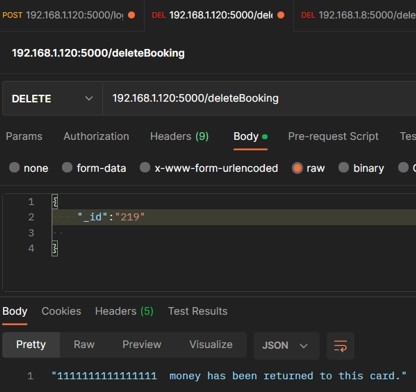
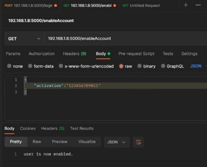

## Χρήσιμα Εργαλεία

Τα εργαλεία που θα χρησιμοποιήσουμε την υλοποίηση της εργασίας είναι τα εξής:

•Visual Studio Code: ο editor που θα προτιμήσουμε για την σύνταξη του python κώδικα.  
•Postman: η πλατφόρμα που θα χρησιμοποιήσουμε για την ανάπτυξη του API.  
•MongoDBCompass: το GUI που θα μας επιτρέψει να βλέπουμε τι συμβαίνει στη βάση δεδομένων κάθε στιγμή.  
•Virtual Box: το περιβάλλον που θα χρησιμοποιήσουμε για την εγκατάσταση του ubuntu.  
•Ubuntu: το λογισμικό που θα υποστηρίξει την υλοποίηση image, docker compose.  
Αρχικά, θα κάνουμε import  το JSON αρχείο στη MongoDBCompass ώστε να υπάρχει σύνδεση με τη βάση δεδομένων.
## Ερώτημα 1: createUser/User 
Υλοποιώντας κλήση της μεθόδου Post, το ανάλογο path και την εισαγωγή σε json μορφή των απαιτούμενων στοιχείων, ο χρήστης μπορεί να στείλει αίτημα για την εγγραφή του στο σύστημα.  

Υστερα πραγματοποιείται έλεγχος αν έχουν δοθεί τα απαιτούμενα δεδομένα, αν η json μορφή είναι η κατάλληλη και αν τηρούνται οι περιορισμοί που έχουν διατυπωθεί. Εφόσον ισχύουν αυτά, η εγγραφή στο σύστημα είναι επιτυχής και πραγματοποιείται καταχώρηση των στοιχείων στη βάση δεδομένων, στην αντίθετη περίπτωση εμφανίζεται το ανάλογο μήνυμα.  

### Επιτυχημένη Εγγραφή - Postman  
  

### Επιτυχημένη Εγγραφή - Mongo   
  

### Αποτυχημένη Εγγραφή (failure = existing name) - Postman
  

### Αποτυχημένη Εγγραφή (failure = existing passport) - Postman  
  

### Αποτυχημένη Εγγραφή (failure = passport form) - Postman     
   

## Ερώτημα 2: Login/User  
Δίνοντας ως input ένα email ή ένα username και τον ανάλογο κωδικό, θα υλοποιηθεί ένας έλεγχος εγκυρότητας των στοιχείων μέσα στη βάση δεδομένων. Εάν υπάρξει ταυτοποίηση, το Postman επιστρέφει ως response το email δώθηκε και ένα uuid, μία μεταβλητή που θα που θα αλλάζει μετά από κάθε login session, η οποία θα μας φανεί χρήσιμη για την υλοποίηση των ακόλουθων ερωτημάτων.  

### Επιτυχημένo Login (email) - Postman  
  

### Επιτυχημένo Login (name) - Postman   
    

### Αποτυχημένο Login (failure = wrong password) - Postman  
    

### Αποτυχημένο Login (failure = wrong name) - Postman  
  

## Ερώτημα 3: getFlight/User    
H υλοποίηση του ερωτήματος προϋποθέτει τη σύνδεση στο σύστημα, η οποία πραγματοποιείται κάνοντας αντιγραφή το uuid που δόθηκε ως  output κατά το login και τη δήλωση του στους headers του Postman. Την ίδια διαδικασία θα ακολουθήσουμε και στα επόμενα ερωτήματα, ενώ σε περίπτωση που δεν βάλουμε το σωστό uuid, ως response θα λάβουμε “user is not authenticated” και απαραίτητο είναι να γίνει login εκ νέου.  

  

Η επιτυχής ολοκλήρωση του authentication, επιτρέπει την αποδοχή input για την αναζήτηση της πτήσης, το οποίο θα περιλαμβάνει τον προορισμό, την αναχώρηση και την ημερομηνία. Ύστερα υλοποιείται μία αναζήτηση στα Flights προκειμένου να εντοπιστεί αν υπάρχει κάποια διαθέσιμη πτήση που να πληροί τα κριτήρια που δόθηκαν στο  input. Στη περίπτωση που δεν υπάρχει το output θα είναι το ανάλογο, ενώ εφόσον υπάρχει δημιουργείται ένα dictionary που δέχεται και αποθηκεύει τις τιμές της βάσης και αφού το κάνει, το Postman αποστέλλει τις τιμές αυτές ως response σε μορφή json.  

### Επιτυχημένo getFlight - Postman  
   

### Επιτυχημένo getFlight - Mongo  
  

### Αποτυχημένο getFlight (destination doesnt exist) - Postman  
  

## Ερώτημα 4: Booking/User 
Ομοίως με πριν, η διαδικασία έχει ως εξής:

### Επιτυχημένo booking - Postman  
  

### Επιτυχημένo booking - Mongo 
  

### Αποτυχημένο booking (wrong id) - Postman 
 

## Ερώτημα 5: getBooking/User 
Ομοίως με πριν, η διαδικασία έχει ως εξής:  

### Επιτυχημένo getBooking - Postman 
 

### Αποτυχημένο getBooking (wrong id) - Postman 
 

## Ερώτημα 6: deleteBooking/User 
Ομοίως με πριν, η διαδικασία έχει ως εξής:   

### Επιτυχημένo deleteBooking - Postman 
   

### Επιτυχημένo deleteBooking - Mongo
 

## Ερώτημα 7: getBookingDate/User 
Ομοίως με πριν, η διαδικασία έχει ως εξής:  

### Ascending getBookingDate - Postman 
    

### Descending getBookingDate - Postman 
    

## Ερώτημα 8: getBookingPrice/User 
Ομοίως με πριν, η διαδικασία έχει ως εξής:  

### getBookingPrice - Postman 
  

## Ερώτημα 9: getBookingDestination/User 
Ομοίως με πριν, η διαδικασία έχει ως εξής:  

### Επιτυχημένo getBookingDestination - Postman
   

### Επιτυχημένo getBookingDestination - Mongo
   

### Αποτυχημένο getBookingDestination (destination doesnt exist) - Postman
 
 
## Ερώτημα 10: getBookingDestination/User 
Ομοίως με πριν, η διαδικασία έχει ως εξής:

### Επιτυχημένo disableAccount - Postman
    

### Επιτυχημένo disableAccount - Postman
  

## Ερώτημα 11: enableAccount/User 
Ομοίως με πριν, η διαδικασία έχει ως εξής:  

### Επιτυχημένo enableAccount - Postman
   

### Επιτυχημένo enableAccount - Postman
   

## Ερώτημα 12: createAdmin/Admin
Ομοίως με πριν, η διαδικασία έχει ως εξής: 

### Επιτυχημένo createAdmin - Postman
   

### Επιτυχημένo createAdmin - Mongo
 

### Επιτυχημένo createAdmin - Postman
   

## Ερώτημα 13: addFlight/Admin
Ομοίως με πριν, η διαδικασία έχει ως εξής: 

### Επιτυχημένo addFlight - Postman
   

### Επιτυχημένo addFlight - Mongo
    

## Ερώτημα 14: updateFlight/Admin
Ομοίως με πριν, η διαδικασία έχει ως εξής: 

### Επιτυχημένo updateFlight - Postman
  

### updateFlight before - Mongo
  

### updateFlight after - Mongo
   

### Αποτυχημένο updateFlight (negative price) - Postman
   

## Ερώτημα 15: deleteFlight/Admin
Ομοίως με πριν, η διαδικασία έχει ως εξής: 

### Επιτυχημένo deleteFlight - Postman
  

### Επιτυχημένo deleteFlight - Mongo
   

### Αποτυχημένο deleteFlight (wrong id) - Postman
  

Η διαδικασία που ακολουθεί στη συνέχεια είναι να γίνει docker compose η εργασία. Αφού εγκαταστήσουμε το vmware και το ubuntu, κάνουμε επικόλληση τους κώδικες docker σε τρια διαφορετικά σκριπτς. Ύστερα, docker build το app.py ωστε να φτιαχτεί το image της εργασίας και εν τέλει docker compose up.

